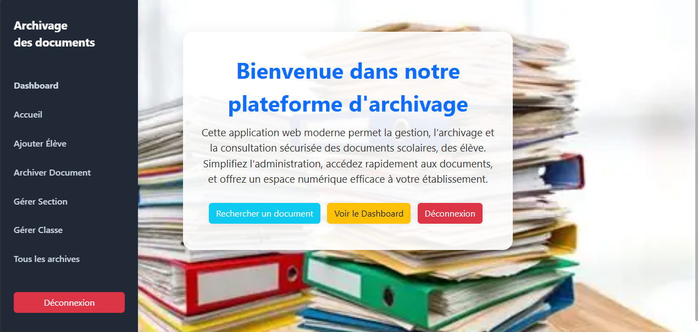

# 🗂️ ARCHIVER - Gestionnaire de Documents Scolaires (par JOHN KAKUSU)

Une application web simple et efficace développée en PHP pour la numérisation, la gestion et l'archivage sécurisé des documents scolaires (bulletins, attestations, relevés de notes, etc.).

## 🎯 À propos du projet

Ce projet vise à fournir aux établissements scolaires (ou aux étudiants) un outil centralisé pour remplacer les archives papier. Il permet de télécharger, classifier et retrouver facilement des documents importants, réduisant ainsi la paperasse et améliorant l'accessibilité.

## 📸 Aperçu

Voici une capture d'écran de l'interface principale de l'application.

<p align="center">
  
</p>

## ✨ Fonctionnalités clés

* 📤 **Upload de fichiers** : Ajout facile de documents (PDF, DOCX, JPG, PNG...).
* 🔍 **Recherche Avancée** : Retrouvez des documents par nom, élève, date, ou catégorie.
* 🗂️ **Catégorisation** : Organisez les fichiers par type (Bulletins, Certificats, Devoirs...) ou par année académique.
* 👤 **Gestion des Utilisateurs** : [Optionnel : si vous l'avez fait] Différents niveaux d'accès (Administrateur, Enseignant, Étudiant).
* 💾 **Téléchargement sécurisé** : Récupérez les documents archivés à tout moment.

## 🛠️ Technologies utilisées

* **Backend** : PHP [précisez la version, ex: 7.4 ou 8.1]
* **Base de données** : MySQL (ou MariaDB)
* **Frontend** : HTML5, CSS3, JavaScript [si vous en utilisez]
* **Serveur** : Apache (recommandé, via XAMPP ou WAMP)

## 🚀 Installation et Démarrage

Suivez ces étapes pour configurer le projet sur votre machine locale.

### Prérequis

* Un serveur web local (XAMPP, WAMP, MAMP...)
* PHP [votre version]
* MySQL / MariaDB
* Git (recommandé)

### Étapes d'installation

1.  **Clonez le dépôt** (ou téléchargez le ZIP) :
    ```bash
    git clone [https://github.com/kakusu243/ARCHIVER.git](https://github.com/kakusu243/ARCHIVER.git)
    ```

2.  **Accédez au dossier** du projet :
    ```bash
    cd ARCHIVER
    ```

3.  **Base de données** :
    * Ouvrez phpMyAdmin (ou votre outil de BDD préféré).
    * Créez une nouvelle base de données nommée `[nom_de_votre_bdd]`.
    * Importez le fichier `[votre_fichier.sql]` (s'il existe) dans cette base de données pour créer les tables.

4.  **Configuration** :
    * Trouvez le fichier de configuration (ex: `config.php` ou `db_connect.php`).
    * Modifiez-le pour y mettre vos informations de connexion à la base de données (hôte, nom d'utilisateur, mot de passe, nom de la base).

5.  **Démarrez votre serveur** :
    * Assurez-vous que les modules Apache et MySQL de votre XAMPP/WAMP sont en cours d'exécution.
    * Placez le dossier du projet dans le répertoire `htdocs` (pour XAMPP) ou `www` (pour WAMP).

6.  **Accédez à l'application** :
    * Ouvrez votre navigateur et allez à `http://localhost/ARCHIVER`

## 🤝 Contribution

[Cette section est facultative, mais recommandée si votre projet est open source.]

Les contributions sont les bienvenues ! Si vous souhaitez améliorer ce projet, veuillez d'abord "Fork" le dépôt et créer une "Pull Request" pour soumettre vos modifications.

1.  Fork le projet
2.  Créez votre branche de fonctionnalité (`git checkout -b feature/NouvelleFonctionnalite`)
3.  Commitez vos changements (`git commit -m 'Ajout de NouvelleFonctionnalite'`)
4.  Poussez vers la branche (`git push origin feature/NouvelleFonctionnalite`)
5.  Ouvrez une Pull Request

## 📄 Licence

Ce projet crée par JOHN KAKUSU est sous la licence [MIT]. Voir le fichier `LICENSE` pour plus de détails.
